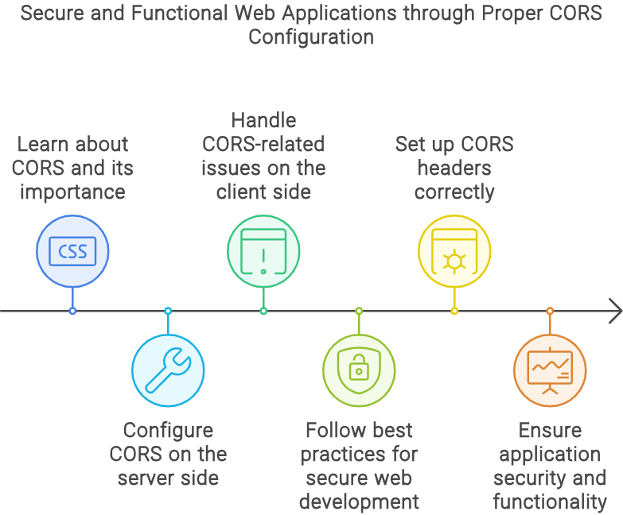

> Cross-Origin Resource Sharing (CORS) là một tính năng bảo mật được triển khai trong các trình duyệt web để kiểm soát cách các tài nguyên trên một trang web có thể được yêu cầu từ một miền khác ngoài miền mà tài nguyên đó xuất phát. Tài liệu này cung cấp thông tin về CORS là gì, tại sao nó quan trọng và cách nó hoạt động. Nó cũng bao gồm các vấn đề phổ biến mà các nhà phát triển gặp phải với CORS và cách giải quyết chúng.
> 

## Giới thiệu về CORS

CORS là một cơ chế sử dụng các tiêu đề(header) HTTP để cho phép một máy chủ chỉ định bất kỳ nguồn gốc(origin) ngoài chính nó từ đó trình duyệt sẽ cho phép tải các tài nguyên. Nó là một phần quan trọng của bảo mật web và giúp ngăn chặn các trang web độc hại truy cập vào dữ liệu nhạy cảm trên một trang web khác.


Trong CORS, "origin" là một thành phần quan trọng để xác định nguồn gốc của một tài nguyên hoặc yêu cầu, bao gồm giao thức (protocol), tên miền (domain), và cổng (port). Tổng thể, một “origin” là tập hợp của:

1. Giao thức (protocol) - ví dụ: `http`, `https`.
2. Tên miền (domain) - ví dụ: `example.com`.
3. Cổng (port) - ví dụ: `:80`, `:443`.

Ví dụ:

- `http://example.com:80`
- `https://sub.example.com`

Trong CORS, trình duyệt sử dụng thông tin về origin để quyết định xem liệu một yêu cầu từ một nguồn gốc khác (cross-origin) có được phép truy cập tài nguyên hay không. Server có thể sử dụng tiêu đề HTTP `Access-Control-Allow-Origin` để chỉ định các nguồn gốc được phép truy cập tài nguyên của nó.


## Cách CORS hoạt động

Khi một ứng dụng web gửi một yêu cầu đến một miền khác, trình duyệt sẽ gửi một yêu cầu HTTP với Header `Origin`. Máy chủ sau đó quyết định có cho phép yêu cầu dựa trên tiêu đề này hay không.


### Yêu Cầu Đơn Giản

Đối với các yêu cầu đơn giản (GET, POST, HEAD), trình duyệt gửi yêu cầu với Header `Origin`. Máy chủ phản hồi với tài nguyên được yêu cầu và bao gồm tiêu đề `Access-Control-Allow-Origin` để chỉ ra liệu yêu cầu có được phép hay không.

Ví dụ về một yêu cầu đơn giản:

```
GET /resource HTTP/1.1
Host: api.example.com
Origin: <http://example.com>
```

Ví dụ về phản hồi từ máy chủ:

```
HTTP/1.1 200 OK
Access-Control-Allow-Origin: <http://example.com>
Content-Type: application/json

{ "data": "sample data" }
```

### Yêu Cầu Phức Tạp (preflight)

Đối với các yêu cầu phức tạp hơn (ví dụ: PUT, DELETE, hoặc các yêu cầu với Header tùy chỉnh), trình duyệt gửi một yêu cầu tiền phiên sử dụng phương thức OPTIONS để xác định xem yêu cầu thực sự có an toàn để gửi hay không.

Ví dụ về một yêu cầu preflight:

```
OPTIONS /resource HTTP/1.1
Host: api.example.com
Origin: http://example.com
Access-Control-Request-Method: PUT
Access-Control-Request-Headers: Content-Type
```

Ví dụ về phản hồi của máy chủ cho một yêu cầu preflight:

```
HTTP/1.1 204 No Content
Access-Control-Allow-Origin: http://example.com
Access-Control-Allow-Methods: GET, POST, PUT, DELETE
Access-Control-Allow-Headers: Content-Type
```

## Cấu hình CORS

### Cấu hình phía máy chủ

Để kích hoạt CORS trên phía máy chủ, bạn cần cấu hình máy chủ của mình để bao gồm các header phù hợp trong các phản hồi của nó. Dưới đây là các ví dụ cho các môi trường máy chủ khác nhau:

#### Node.js (Express)

```jsx
const express = require('express');
const cors = require('cors');
const app = express();

app.use(cors());

app.get('/resource', (req, res) => {
  res.json({ data: 'sample data' });
});

app.listen(3000, () => {
  console.log('Server running on port 3000');
});

```

#### Apache

```
<IfModule mod_headers.c>
    Header set Access-Control-Allow-Origin "*"
</IfModule>

```

#### Nginx

```
location /resource {
    add_header 'Access-Control-Allow-Origin' '*';
}

```

### Cấu Hình Phía Client

Trong khi CORS chủ yếu là cấu hình phía máy chủ, việc hiểu cách xử lý lỗi CORS ở phía khách hàng cũng quan trọng. Hầu hết các trình duyệt hiện đại sẽ chặn các yêu cầu vi phạm chính sách CORS và ghi lỗi vào bảng điều khiển.

Ví dụ về xử lý lỗi CORS trong JavaScript:

```jsx
fetch('http://api.example.com/resource')
  .then(response => {
    if (!response.ok) {
      throw new Error('Network response was not ok');
    }
    return response.json();
  })
  .then(data => console.log(data))
  .catch(error => console.error('There was a problem with the fetch operation:', error));

```

## Các Vấn Đề Thường Gặp về CORS và Giải Pháp

### Vấn Đề: Thiếu Header 'Access-Control-Allow-Origin'

**Giải Pháp:** Đảm bảo máy chủ của bạn được cấu hình để bao gồm header `Access-Control-Allow-Origin` trong các phản hồi của nó.

### Vấn Đề: Yêu Cầu Preflight Thất Bại

**Giải Pháp:** Đảm bảo máy chủ của bạn xử lý đúng các yêu cầu OPTIONS và bao gồm các header CORS cần thiết.

### Vấn Đề: Yêu Cầu Được Cấp Quyền

**Giải Pháp:** Nếu yêu cầu của bạn bao gồm thông tin xác thực (cookies, xác thực HTTP), đảm bảo máy chủ bao gồm header `Access-Control-Allow-Credentials` và không sử dụng ký tự đại diện `*` cho `Access-Control-Allow-Origin`.



Ví dụ:

```jsx
Access-Control-Allow-Origin: http://example.com
Access-Control-Allow-Credentials: true
```

## Kết luận

CORS là một tính năng bảo mật quan trọng giúp bảo vệ người dùng bằng cách đảm bảo rằng các ứng dụng web chỉ có thể yêu cầu tài nguyên từ các nguồn được phép. Cấu hình đúng CORS ở phía máy chủ và hiểu cách xử lý các vấn đề liên quan đến CORS ở phía khách hàng là rất quan trọng cho việc phát triển các ứng dụng web an toàn. Bằng cách tuân theo các thực hành tốt nhất và thiết lập chính xác các tiêu đề CORS, các nhà phát triển có thể đảm bảo rằng ứng dụng của họ vừa an toàn vừa hoạt động tốt.